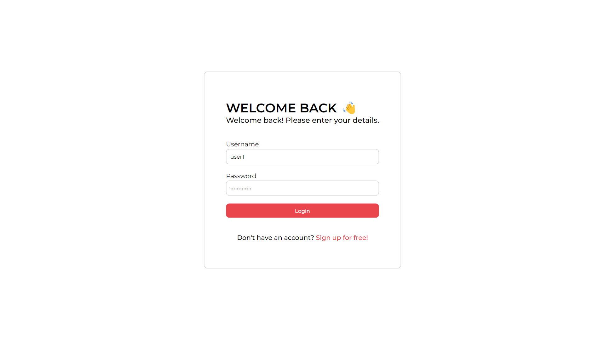

# FlyUpload: Images and Video Management Dashboard

## Overview

**FlyUpload** is a robust web application designed to manage images and videos efficiently in the cloud. Built with the MERN stack (MongoDB, Express, React, Node.js), FlyUpload provides a comprehensive dashboard with user authentication, file upload capabilities for images and videos.

## Features

- **User Authentication**: Secure login and signup functionality using email or username.
- **Dashboard**: Intuitive and user-friendly interface.
- **File Upload**: Seamless upload of images and videos with support for multiple file formats.
- **Cloud Storage**: Integration with cloud services to store and manage uploaded files.

## Tech Stack

- **Frontend**: React.js
- **Backend**: Node.js, Express.js
- **Database**: MongoDB
- **File Handling**: Multer
- **Authentication**: JWT (JSON Web Tokens)

## Video Demo

## Video Demo

[Click here to watch the demo video](https://res.cloudinary.com/dgszxxbcl/video/upload/v1719076738/videos/bvzwlnzoyocdwym9qe7y.mp4)

## Screenshots


*Signup page*


*Login page*


*Dashboard*


*File preview*

## Getting Started

### Prerequisites

- Node.js
- MongoDB
- nodemon (optional, for backend server)

### Installation

1. Clone the repository:
   ```bash
   git clone https://github.com/patilmanas04/Fly-Upload.git
   cd 'Fly-Upload'
   ```

2. Install backend dependencies:
    ```bash
    cd backend
    npm install
    ```

3. Install frontend dependencies:
    ```bash
    cd ../frontend
    npm install
    ```

4. Set up environment variables:

    Create a `.env` file in the `backend` directory and add the following variables:
    ```bash
    MONGO_URI=your_mongodb_connection_string
    JWT_SECRET=your_jwt_secret
    CLOUDINARY_CLOUD_NAME=your_cloudinary_cloud_name
    CLOUDINARY_API_KEY=your_cloudinary_api_key
    CLOUDINARY_SECRET_KEY=your_cloudinary_secret_key
    ```

### Running the Application

1. Start the backend server:
    ```bash
    cd backend
    nodemon index.js
    ```

2. Start the frontend server:
    ```bash
    cd ../frontend
    npm run dev
    ```

3. Open your browser and navigate to `http://localhost:3000` to view the application.

## Contributing
Contributions are welcome! Please fork the repository and submit a pull request for any enhancements or bug fixes.

## License
This project is licensed under the MIT License - see the [LICENSE](LICENSE) file for details.

## Contact
For any questions or inquiries, please reach out to the project maintainer at `pmanas13092004@gmail.com`.